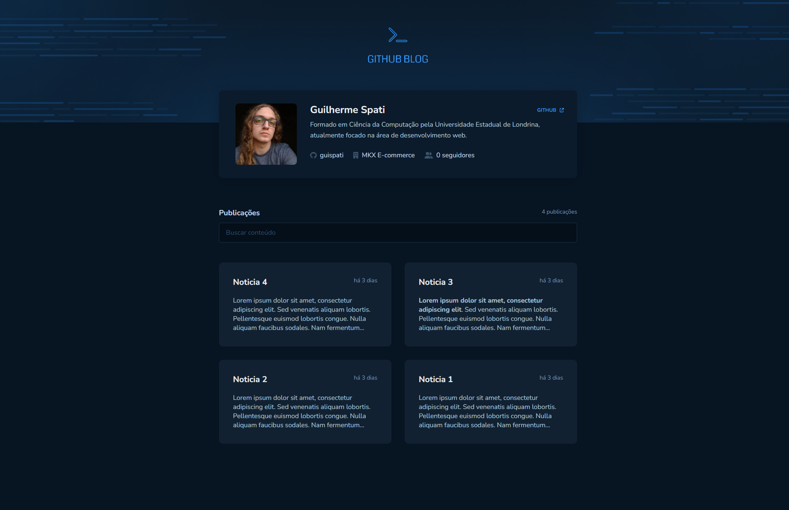
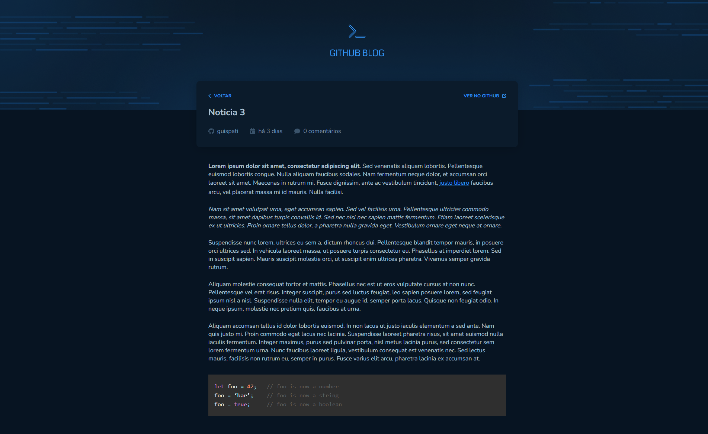

<h1 align="center">
    
</h1>

<span align="center">
    
</span>

Esse projeto se trata de uma aplicação que utiliza a API do Github buscar issues de um repositório, dados do seu perfil e exibir elas como um blog.

## 🛠️ Construído com

Esse projeto foi desenvolvido com as seguintes tecnologias:

- [Vite](https://vitejs.dev)
- [ReactJS](https://reactjs.org)
- [TypeScript](https://www.typescriptlang.org/)
- [Styled Components](https://styled-components.com)

### 📋 Pré-requisitos

Para clonar e rodar essa aplicação, será necessário o [Git](https://git-scm.com) e o [Node.js](https://nodejs.org/en/) instalados no seu computador.

### 🔧 Como usar

```bash
# Clone este repositório
$ git clone https://github.com/guispati/Github-Blog.git

# Abra a pasta criada
$ cd Github-Blog

# Instale as dependências
$ npm install

# Inicie o projeto
$ npm run dev

# Você pode alterar o usuário e repositório das issues em src/lib/axios.ts
```

## 💻 Demonstração

Na tela inicial você pode visualizar todos os posts (issues) com seu respectivo título, tempo de publicação e um breve resumo do conteúdo além de ter a opção de filtrar os posts fazendo uma busca personalizada, todos os resultados são puxados diretamente da API do Github:


Ao clicar em um post, você será redirecionado para a página onde é possível visualizar o conteúdo completo daquele post juntamente com suas informações como autor, data de postagem, quantidade de comentários, puxados diretamente da API do Github:


## 📄 Licença

Este projeto está sob a licença MIT - veja o arquivo [LICENSE.md](LICENSE.md) para mais detalhes.

---
⌨️ com ❤️ por [Guilherme Spati](https://github.com/guispati) 😊